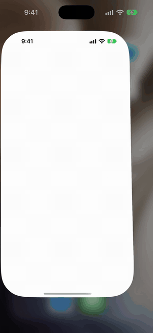
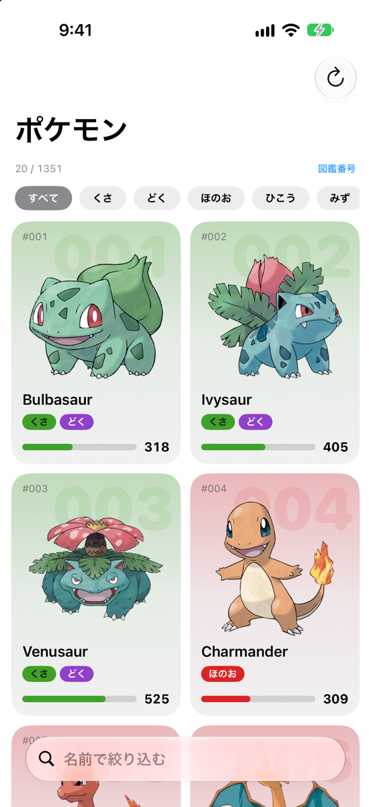
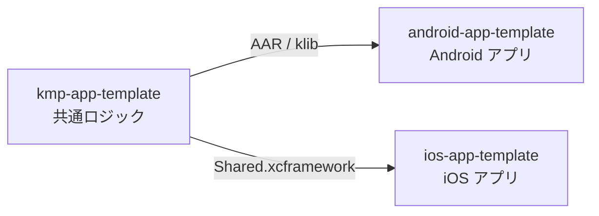
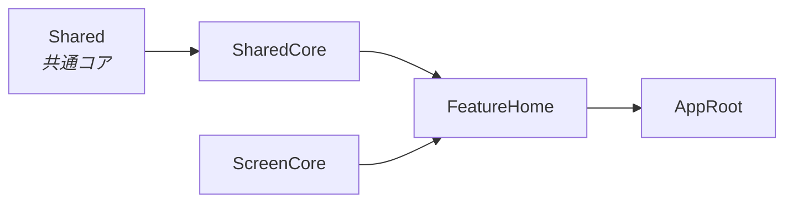

# ios-app-template

SwiftUI と Kotlin Multiplatform で作る、ポケモン図鑑アプリのテンプレート

<picture>
  <source media="(prefers-color-scheme: dark)" srcset="docs/images/list-dark.png">
  
</picture>

PokeAPI のポケモンを、無限スクロール・タイプでの絞り込み・並び替え・詳細画面で見られます。データの取得とページングは共通コア（Kotlin Multiplatform）が担い、このリポジトリは iOS の画面と状態管理だけを持ちます。

## 3 つのリポジトリ

[kmp-app-template](https://github.com/yossibank/kmp-app-template) ・ [android-app-template](https://github.com/yossibank/android-app-template)

## モジュール構成

| モジュール | 役割 |
| --- | --- |
| `SharedCore` | 共通コアとの境界。KMP の型を Swift の型に直して渡す |
| `ScreenCore` | 画面の土台（読み込み状態の管理）と、機能に依らない UI 部品 |
| `FeatureHome` | 一覧と詳細の画面 |
| `AppRoot` | 画面の組み立て |

## 動かし方

> [!NOTE]
> 共通コアを GitHub から取得するため、`~/.netrc` に `api.github.com` の資格情報が必要です。

手順

1. `make bootstrap` で SwiftFormat / SwiftLint を用意する
2. `make open` で `AppTemplate.xcworkspace` を開く
3. 変更したら `make verify` を通す

