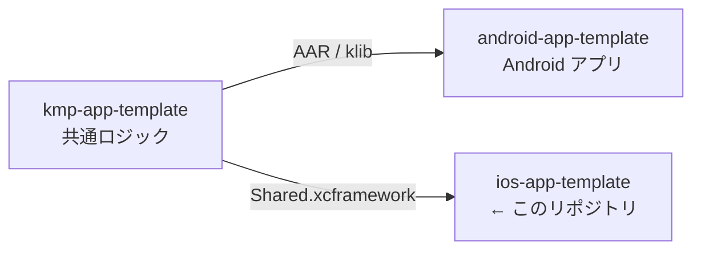
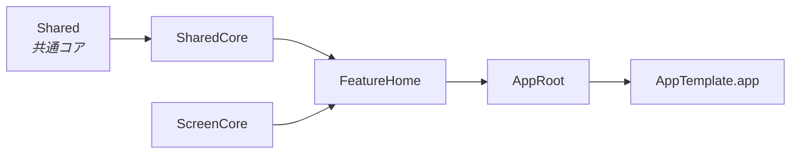

# ios-app-template

> iOS アプリの初期テンプレート。画面とロジックはローカル SPM パッケージに分割している。

書き方の規約は [CLAUDE.md](CLAUDE.md)。

## 3 リポジトリの関係



[android-app-template](https://github.com/yossibank/android-app-template) ・
[kmp-app-template](https://github.com/yossibank/kmp-app-template)

## モジュール構成



| モジュール | 役割 |
| --- | --- |
| `ScreenCore` | 画面の土台と、機能に依らない UI 部品。共通コアに依存しない |
| `SharedCore` | 共通コアの腐敗防止層。`Shared` を import してよいのはここだけで、外には Swift の型だけを出す |
| `FeatureHome` | 画面 1 つ分。機能ごとに `Feature<名前>` を並べる |
| `AppRoot` | 画面の組み立て |
| アプリターゲット | 起動と Assets のみ |

`SharedCore` は KMP の型を再 export しない。`Int32`・`String` の URL・SKIE の sealed 変換は
すべてここで Swift の `Pokemon` / `PokemonListPage` / `PokemonLoadFailure` に直してから外に出す。

## ディレクトリ

```
AppTemplate.xcworkspace     # 入口
AppTemplate.xctestplan      # テスト対象。増やしたらここに足す
App/
├── AppTemplate.xcodeproj
└── AppTemplate/           # @main と Assets
Package/
├── Package.swift          # 依存とモジュールの宣言（共通コアのバージョンもここ）
├── Sources/
│   ├── ScreenCore/        # ViewModel/ Fetch/ Screen/ UI/ Resources/
│   ├── SharedCore/        # Pokemon/（共通コアの型を Swift に直す）
│   ├── FeatureHome/       # 画面と Component/ Style/ Resources/
│   └── AppRoot/
└── Tests/
    ├── ScreenCoreTests/
    ├── SharedCoreTests/   # 共通コアからの変換
    └── FeatureHomeTests/
```

**入口は `.xcodeproj` ではなく `.xcworkspace`。**

## コマンド

| コマンド | 内容 |
| --- | --- |
| `make open` | Xcode で `AppTemplate.xcworkspace` を開く |
| `make bootstrap` | `Mintfile` の版で SwiftFormat / SwiftLint を用意する |
| `make verify` | lint + ユニットテスト + ビルド（変更後はこれを通す） |
| `make verify SIMULATOR='iPhone 17'` | シミュレータを指定して実行 |
| `make build` | ビルドのみ |
| `make test` | ユニットテストのみ（`AppTemplate.xctestplan` の全ターゲット） |
| `make lint` | SwiftFormat / SwiftLint によるチェック（`make verify` に含まれる） |
| `make format` | SwiftFormat / SwiftLint で自動修正 |

## 環境

| 項目 | 出所 |
| --- | --- |
| Swift 言語モード・Deployment Target | [project.pbxproj](App/AppTemplate.xcodeproj/project.pbxproj) の `SWIFT_VERSION` / `IPHONEOS_DEPLOYMENT_TARGET` |
| Package の対象 OS・共通コア | [Package/Package.swift](Package/Package.swift) |
| SwiftFormat / SwiftLint | [Mintfile](Mintfile)。手元は Mint 経由、CI は同じ版の配布バイナリ |
| Xcode | リポジトリでは固定していない。CI は [verify.yml](.github/workflows/verify.yml) のランナー任せ |
| 認証 | `~/.netrc` に `api.github.com` の資格情報（共通コアの取得に必要） |
