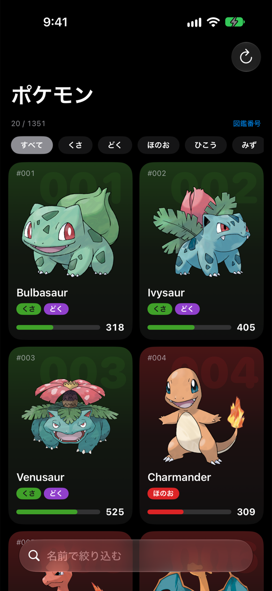
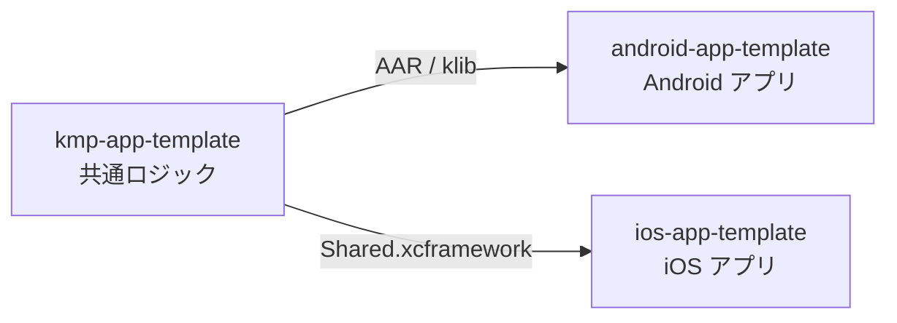
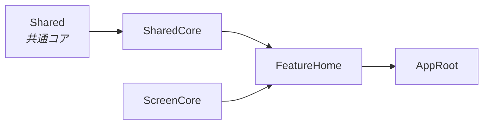

# ios-app-template

SwiftUI で作った iOS アプリのテンプレートです。題材は PokeAPI のポケモン一覧で、無限スクロール・絞り込み・並び替え・詳細画面を備えています。

データの取得とページングは Kotlin Multiplatform の共通コアが担い、このリポジトリは iOS 固有の画面と状態管理だけを持ちます。

  
  

## 3 つのリポジトリ

- [kmp-app-template](https://github.com/yossibank/kmp-app-template) — 通信・ページング・エラーの分類
- [android-app-template](https://github.com/yossibank/android-app-template) — 同じ画面の Android 版

## モジュール構成

画面とロジックはローカルの Swift Package に分け、依存は一方向にしています。

| モジュール | 役割 |
| --- | --- |
| `SharedCore` | 共通コアとの境界。KMP の型を Swift の型に直して渡す |
| `ScreenCore` | 画面の土台（読み込み状態の管理）と、機能に依らない UI 部品 |
| `FeatureHome` | 一覧と詳細の画面 |
| `AppRoot` | 画面の組み立て |

## 技術スタック

| | |
| --- | --- |
| UI / 状態管理 | SwiftUI / Observation |
| 並行性 | Swift Concurrency（言語モード 6） |
| テスト | Swift Testing |
| 依存管理 | Swift Package Manager（共通コアは GitHub Releases の XCFramework） |
| 書式・静的解析 | SwiftFormat / SwiftLint（Mint で版を固定） |

## 動かし方

1. `~/.netrc` に `api.github.com` の資格情報を置く（共通コアの取得に必要）
2. `make bootstrap` で SwiftFormat / SwiftLint を用意する
3. `make open` で `AppTemplate.xcworkspace` を開く

変更したら `make verify` を通します。
