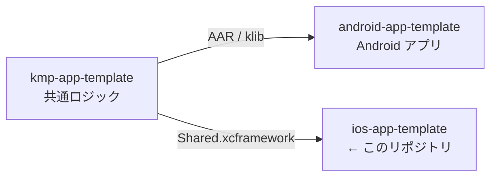

# ios-app-template

> iOS アプリの初期テンプレート。SwiftUI の 1 画面のみを含む最小構成。

## 3 リポジトリの関係

[android-app-template](https://github.com/yossibank/android-app-template) ・
[kmp-app-template](https://github.com/yossibank/kmp-app-template)

## コマンド

| コマンド | 内容 |
| --- | --- |
| `make verify` | ビルド + ユニットテスト（変更後はこれを通す） |
| `make build` | ビルドのみ |
| `make verify SIMULATOR='iPhone 17'` | シミュレータを指定して実行 |
| `make lint` | SwiftFormat / SwiftLint によるチェック（`make verify` に含まれる） |
| `make format` | SwiftFormat / SwiftLint で自動修正 |

## 環境

| 項目 | バージョン |
| --- | --- |
| Xcode | 26.x |
| Swift | 5.0 |
| Deployment Target | iOS 26.5 |
| 認証 | `~/.netrc` に `api.github.com` の資格情報（共通コアの取得に必要） |
