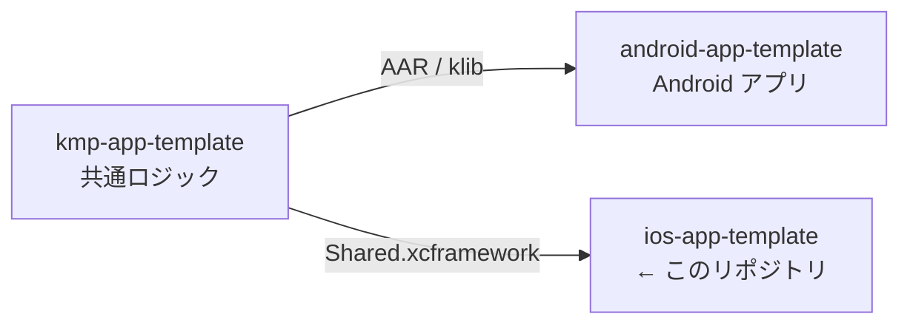

# ios-app-template

> iOS アプリの初期テンプレート。SwiftUI の 1 画面のみを含む最小構成。

## 3 リポジトリの関係

[android-app-template](https://github.com/yossibank/android-app-template) ・
[kmp-app-template](https://github.com/yossibank/kmp-app-template)

## コマンド

| コマンド | 内容 |
| --- | --- |
| `make bootstrap` | 共通コアの XCFramework を生成（clone 直後に 1 度。`../kmp-app-template` が必要） |
| `make verify` | ビルド + ユニットテスト（変更後はこれを通す） |
| `make test-ui` | UI テストも実行する（時間がかかる） |
| `make build` | ビルドのみ |
| `make verify SIMULATOR='iPhone 17'` | シミュレータを指定して実行 |

## 環境

| 項目 | バージョン |
| --- | --- |
| Xcode | 26.x |
| Swift | 5.0 |
| Deployment Target | iOS 26.5 |
