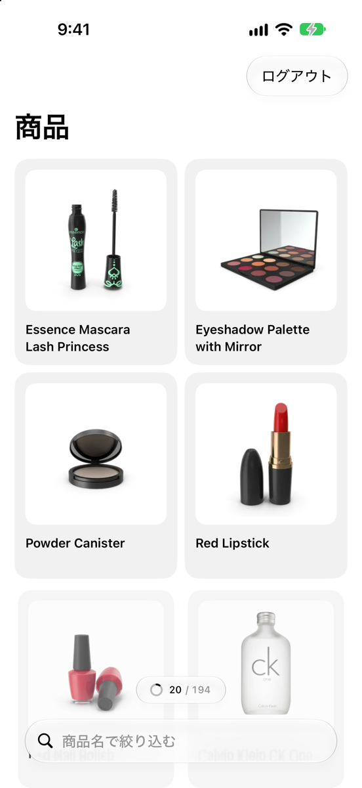
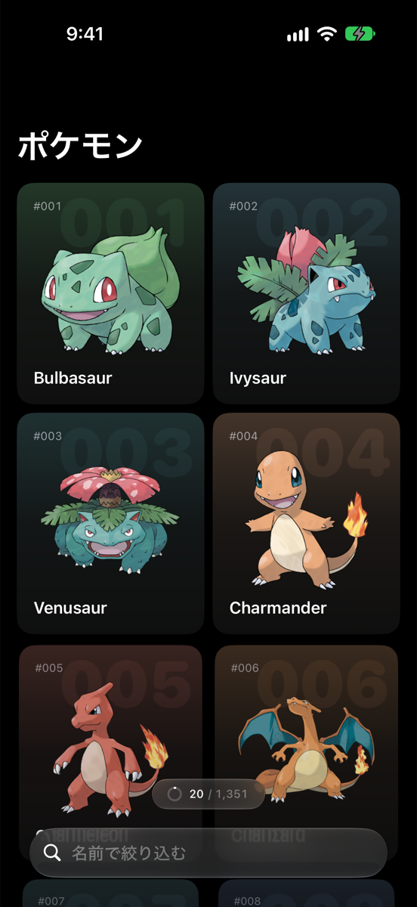
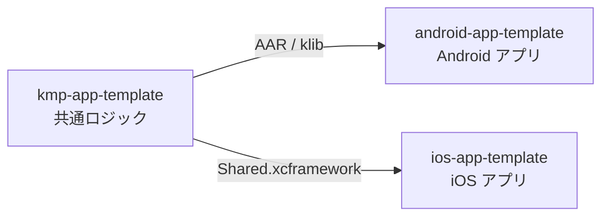
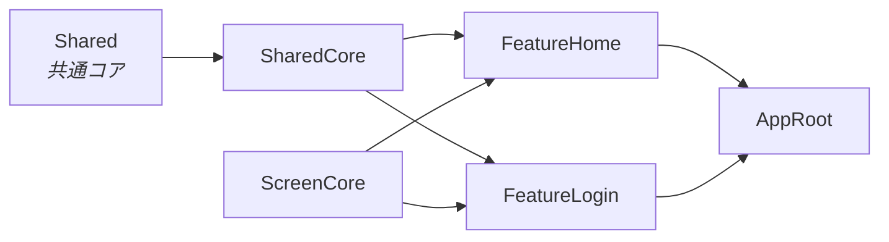

<div align="center">

# ios-app-template

SwiftUI と Kotlin Multiplatform で作る、商品一覧アプリのテンプレート

[](https://github.com/yossibank/ios-app-template/actions/workflows/verify.yml)
[](LICENSE)





</div>

DummyJSON にログインし、商品を無限スクロールと商品名での絞り込みで見られます。

## 3 つのリポジトリ


```mermaid
flowchart LR
    KMP["kmp-app-template<br/>共通ロジック"]
    AND["android-app-template<br/>Android アプリ"]
    IOS["ios-app-template<br/>iOS アプリ"]
    KMP -->|"AAR / klib"| AND
    KMP -->|"Shared.xcframework"| IOS
```

[kmp-app-template](https://github.com/yossibank/kmp-app-template) ・ [android-app-template](https://github.com/yossibank/android-app-template)

## モジュール構成


```mermaid
flowchart LR
    SHARED["Shared<br/><i>共通コア</i>"]
    SHAREDCORE["SharedCore"]
    SCREENCORE["ScreenCore"]
    HOME["FeatureHome"]
    LOGIN["FeatureLogin"]
    ROOT["AppRoot"]
    SHARED --> SHAREDCORE --> HOME
    SCREENCORE --> HOME
    SHAREDCORE --> LOGIN
    SCREENCORE --> LOGIN
    HOME --> ROOT
    LOGIN --> ROOT
```

| モジュール | 役割 |
| --- | --- |
| `SharedCore` | 共通コアとの境界。KMP の型を Swift の型に直して渡す |
| `ScreenCore` | 画面の土台（読み込み状態の管理）と、機能に依らない UI 部品 |
| `FeatureHome` | 一覧の画面 |
| `FeatureLogin` | ログインの画面 |
| `AppRoot` | ログイン状態に応じた画面の切り替え |

## 動かし方

> [!NOTE]
> 共通コアを GitHub から取得するため、`~/.netrc` に `api.github.com` の資格情報が必要です。

1. `make bootstrap` で SwiftFormat / SwiftLint と、コミット前に整形と lint を検査するフックを用意する
2. `make open` で `AppTemplate.xcworkspace` を開く
3. 変更したら `make verify` を通す

<details>
<summary>共通コアを手元のものに差し替える</summary>

kmp-app-template で `make build-ios` してから、そのディレクトリを絶対パスで渡します。

```sh
SHARED_DIR=/path/to/kmp-app-template make verify
```

</details>

<details>
<summary>テンプレートから作ったとき</summary>

パッケージの接頭辞と GitHub のオーナーを置き換えます。3 つのリポジトリそれぞれで実行します。

```sh
scripts/rename.sh <GitHub のオーナー> <パッケージの接頭辞>    # 例: scripts/rename.sh acme com.acme
```

</details>
